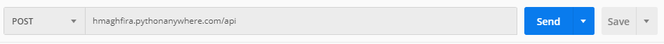
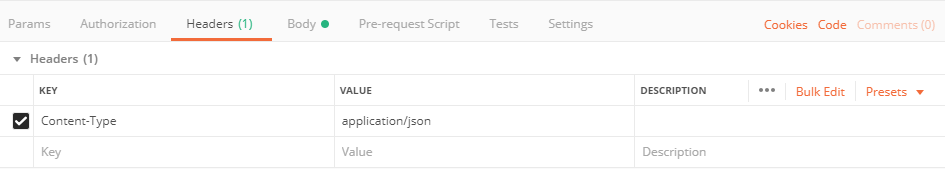
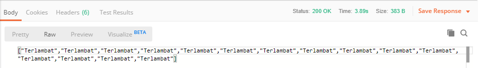
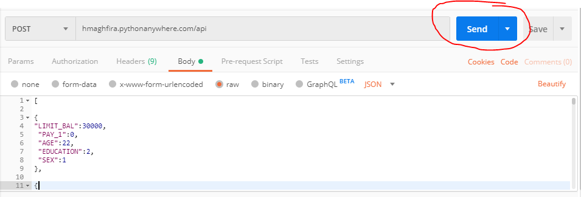

# Analytic Model Deployment
This repository contains model analytics deployment using random forest algorithm. The model is deployed using flask framework. You can run this model by using postman application. 
This repository has two folders :
1. [code](https://github.com/hmaghfira/Analytic-Model-Deployment/tree/master/code)
This folder contains several files:
-  Credit-Score.py : model python
- flask_app.py : server python to be uploaded on Flask
- random_forest.pkl : random forest algorithm in pickle 
- request.py : request model in python to generate the algorithm into pickle
2. [dataset](https://github.com/hmaghfira/Analytic-Model-Deployment/tree/master/dataset)
- training.csv : dataset to build the model
3. [img](https://github.com/hmaghfira/Analytic-Model-Deployment/tree/master/img)
- the photos of the steps

The steps and requirement needed will be explained on the next section.

# Getting Started 
To use the predictor API, you should have :
1. Postman [install here](https://www.getpostman.com/).

# Steps
1. Open the postman, then set the request method to ``POST`` and input the API link ``hmaghfira.pythonanywhere.com/api``.

2. After that, open the Headers tab below the link API. Then, set Key to ``Content-Type`` and Value to ``application/json``.

3. Then, open the Body tab beside of Headers tab. Click ``raw`` and choose ``JSON`` as the type of the input request.

4. Fill the body with the request script. The example of the script is [here](https://github.com/hmaghfira/Analytic-Model-Deployment/blob/master/postman%20request.txt).

The explanation of the input request : 

|NAME|EXPLAIN|EXAMPLE OF INPUT|
|---|---|---|
|LIMIT_BAL|The limit of the credit balance|The amount of rupiah : 30000 (means Rp. 30.000)|
|PAY_1|The status whether the customer pay on time or not| 0 : On time, 1 : late|
|AGE|The age of the customer|Integer : 22 (means 22 years old)|
|EDUCATION|The education level of the customer| 1 : S2/S3, 2 : S1, 3 : SMA, 4 : others|
|SEX|The gender of the customer|1 : Man, 2 : Woman|

5. After that, click ``SEND`` button beside of link API column (the button is blue).

6. On the below of the body script, you will see the result prediction of the credit scoring.

# Author
Hania Maghfira, Astra Data Scientist Bootcamp 2019. 
hania.maghfira@ai.astra.co.id
