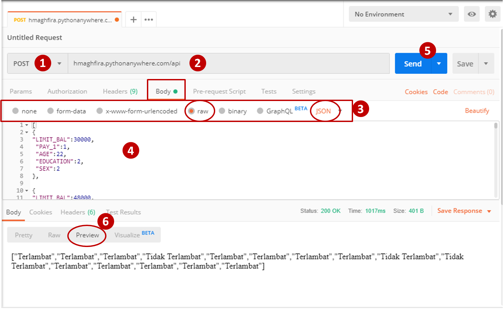

# Analytic Model Deployment
This repository contains credit scoring prediction model using random forest algorithm. The model is deployed by using Flask framework. You can run this model by using postman application. 
This repository has two folders : 

**1. [code](https://github.com/hmaghfira/Analytic-Model-Deployment/tree/master/code)**
- Credit-Score.py : model python.
- flask_app.py : server python to be uploaded on Flask.
- random_forest.pkl : random forest algorithm in pickle.
- request.py : request model in python. 

**2. [dataset](https://github.com/hmaghfira/Analytic-Model-Deployment/tree/master/dataset)**
- training.csv : dataset to build the model.

The steps and requirements needed to run the credit scoring prediction will be explained on the next section.

# Getting Started 
To use this credit scoring prediction model, you should have :
1. Postman [install here](https://www.getpostman.com/).

# Steps
**1. Open the postman, then set the request method to ``POST``.** 
**2. Input the API link ``hmaghfira.pythonanywhere.com/api``.** 
**3. Open the Body tab below the API link column, click ``raw`` and choose ``JSON`` as type of the input request.** 
**4. Fill the body with the request script. The example of the script is [here](https://github.com/hmaghfira/Analytic-Model-Deployment/blob/master/postman%20request.txt)**. The guidance for input parameters, go to this [section](#the-guidance-for-input-parameters) 
**5. After that, click ``SEND`` button beside of API link column (the button is blue) to run the script.** 
**6. On the below of the body script, you will see the result of the credit scoring prediction.**

### The guidance for input parameters 

|NAME|EXPLAIN|EXAMPLE OF INPUT|
|---|---|---|
|LIMIT_BAL|The limit of the credit balance|The amount of rupiah : 30000 (means Rp. 30.000)|
|PAY_1|The status whether the customer pay on time or not| 0 : On time, 1 : late|
|AGE|The age of the customer|Integer : 22 (means 22 years old)|
|EDUCATION|The education level of the customer| 1 : S2/S3, 2 : S1, 3 : SMA, 4 : others|
|SEX|The gender of the customer|1 : Man, 2 : Woman|

# Author
Hania Maghfira, Astra Data Scientist Bootcamp 2019. 
hania.maghfira@ai.astra.co.id
